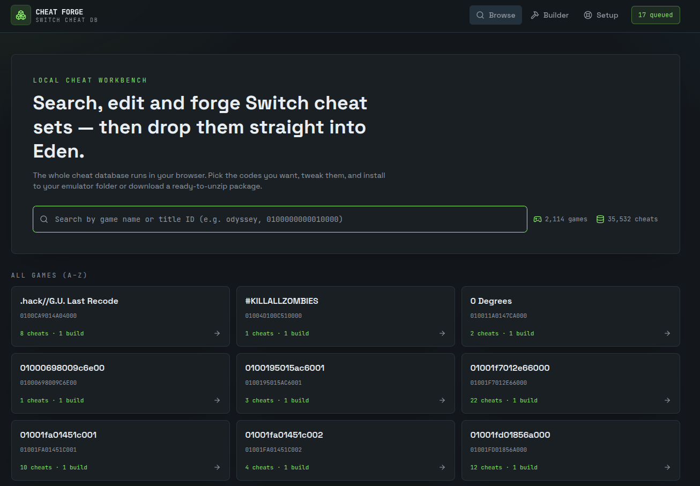
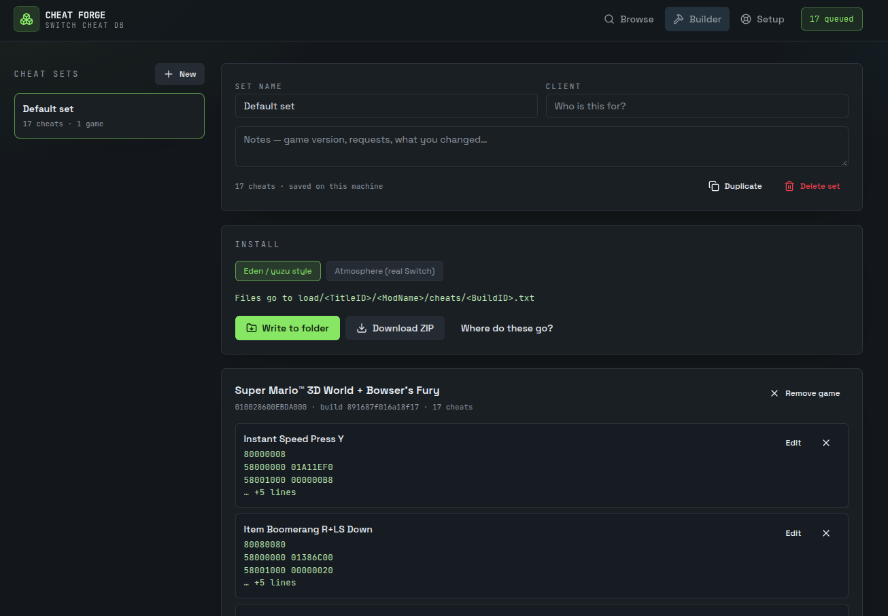
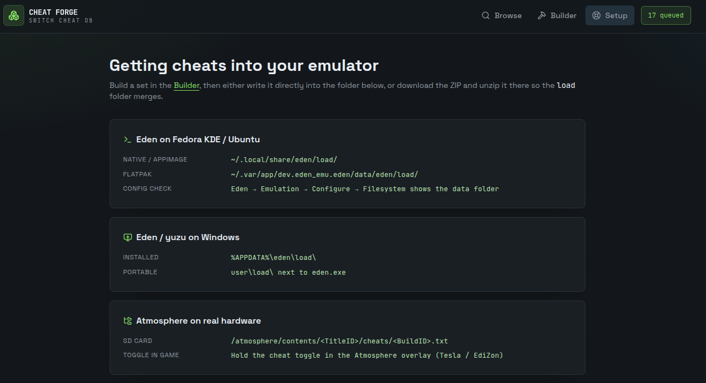

# Cheat Forge — Switch Cheat Workbench

A local, browser-based workbench for searching a Nintendo Switch cheat database, building
per-client cheat sets, and installing them straight into **Eden / yuzu** (Linux or Windows)
or an **Atmosphere** SD card.

- 2,114 games and 35,532 cheats, bundled as static JSON — no server, no account, no uploads
- Search by game name or title ID, browse per-build cheat lists, filter and preview codes
- Collect cheats into named sets, edit code lines, or write your own custom cheats
- Install with one click into your emulator folder, or download a ready-to-unzip package
- Everything stays in your browser's local storage on your own machine

## Screenshots

**Browse and search the database**



**Build a cheat set and install it**



**Setup guide with exact folder paths**



## Run it locally (Node.js)

### Requirements

- **Node.js 20 or newer** — check with `node --version`
  - Fedora: `sudo dnf install nodejs`
  - Ubuntu: `sudo apt install nodejs npm` (or use [nvm](https://github.com/nvm-sh/nvm))
  - Windows: installer from [nodejs.org](https://nodejs.org)
- Git (only if you are cloning rather than downloading a ZIP)

### Steps

```sh
git clone https://github.com/<your-user>/cheat-forge.git
cd cheat-forge
npm install
npm run dev
```

Open **http://localhost:8080** in Chrome, Chromium, Brave or Edge.

Stop the server with `Ctrl+C`.

### Production build

```sh
npm run build
npm run preview
```

## Run it with Docker

### Requirements

- Docker (Fedora: `sudo dnf install docker docker-compose-plugin`, then
  `sudo systemctl enable --now docker`)

### With Docker Compose (easiest)

```sh
docker compose up -d --build
```

Open **http://localhost:8080**. To stop: `docker compose down`.

### With plain Docker

```sh
docker build -t cheat-forge .
docker run -d --name cheat-forge -p 8080:8080 cheat-forge
```

Stop and remove with `docker stop cheat-forge && docker rm cheat-forge`.

Change the host port by editing the left-hand number, e.g. `-p 3000:8080`.

> **Note on the container:** cheat sets are stored in your browser, not in the container,
> so they survive rebuilds. The "Write to folder" button also runs in your browser, so it
> writes to *your* machine's folders — not inside the container.

## Installing cheats

| Setup | Cheat folder |
| --- | --- |
| Eden native / AppImage (Linux) | `~/.local/share/eden/load/` |
| Eden Flatpak (Linux) | `~/.var/app/dev.eden_emu.eden/data/eden/load/` |
| Eden / yuzu installed (Windows) | `%APPDATA%\eden\load\` |
| Eden / yuzu portable (Windows) | `user\load\` next to `eden.exe` |
| Atmosphere (real hardware) | `/atmosphere/contents/<TitleID>/cheats/<BuildID>.txt` |

1. Build a set in the **Builder** page.
2. Click **Write to folder** and pick your `load` folder, or **Download ZIP** and unzip it
   there so the `load` folder merges.
3. In Eden: right-click the game → **Properties** → **Add-Ons** → tick your cheat set.

The build ID must match your game version — cheats with a different build ID silently do
nothing.

**Browser note:** direct folder writing uses the File System Access API, available in
Chrome, Chromium, Brave and Edge. Firefox users should use the ZIP download instead.

## Tech

TanStack Start (React 19) · TypeScript · Tailwind CSS v4 · TanStack Query · JSZip

## Project layout

```
public/cheatdb/        static cheat database (index, meta, sharded game data)
src/lib/cheatdb.ts     database loading, search and cheat-text parsing
src/lib/sets.ts        local cheat-set workspace (browser storage)
src/lib/install.ts     file layout for Eden/yuzu and Atmosphere, ZIP export
src/routes/            browse, game detail, builder and setup pages
```

## License

Personal-use project. Cheat codes belong to their original authors; this tool only
organises and installs them.
